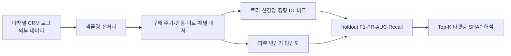

# 동태적 마케팅 지식 기반 구매 전환 예측

[English](README.md)

> [프로젝트 자세히 보기](PORTFOLIO.ko.md)

전환율이 극도로 낮은 이커머스 CRM 환경에서 구매 전환을 예측하는 데이터 중심 AI 연구입니다. 마케팅 이론을 동태 피처로 바꾸고 트리 기반 머신러닝, 신경망, 정형 딥러닝을 비교합니다.

> 연구 수치와 실행 방법은 보관된 실험 결과와 코드에 근거합니다.

## 연구 질문과 데이터

희소한 구매 전환 클래스에서 도메인 지식 기반 동태 피처가 전환 예측과 타겟팅 판단을 개선하는지 살핍니다. 피처는 구매·재구매 주기, 시계열 반응, 마케팅 피로도, 채널 효과성의 네 묶음입니다.

- 데이터: 약 2년의 다채널 이커머스 CRM 로그 약 1억 7,200만 건
- 고객·캠페인: 약 185만 명, 1,907개 캠페인
- 타깃: 구매 전환, 원분포 holdout 전환율 0.1234%
- 비교: ML·신경망·정형 DL 9개 모델, F1·PR-AUC·재현율·타겟팅 분석

## 분석 흐름

원본 CRM 로그는 포함하지 않습니다. 실행 코드와 요약 결과가 이 흐름의 근거를 남깁니다.

## 핵심 결과

제출 원고 기준으로 도메인 피처를 포함한 XGBoost는 다음 성능을 기록했습니다.

| 지표 | 결과 |
|---|---:|
| F1 | 0.3806 |
| PR-AUC | 0.3620 |
| Recall, baseline → 도메인 피처 | 30.74% → 52.30% |
| 상대 Recall 개선 | 70.1% |
| 상위 0.78% 타겟팅 | 전환 95.83% 포착 |
| 해당 조건의 발송 대상 감소 | 99.22% |

이는 문서화된 데이터·holdout에서의 오프라인 분석 결과입니다. 실제 비용 절감, 매출 상승, 일반적인 인과 효과를 뜻하지는 않습니다.

## 실행과 재현성

진입점은 `research/preprocessing_fast.py`, `research/xgb.py`, `research/run_xgb_tau_sweep.py`입니다. 원본 데이터, 학습 모델, lockfile, 이식 가능한 경로 설정이 없어서 현재는 완전한 end-to-end 실행을 검증하지 않았습니다. 경로와 결과 회귀 절차는 [`research/RUN_MANIFEST.md`](research/RUN_MANIFEST.md)에 정리돼 있습니다.

## 문서

- [포트폴리오 사례 연구](PORTFOLIO.ko.md)
- [저장소 리뷰](docs/PROJECT_REVIEW.md)
- [학술 요약](docs/ACADEMIC_SUMMARY.md)
- [실행 매니페스트](research/RUN_MANIFEST.md)
