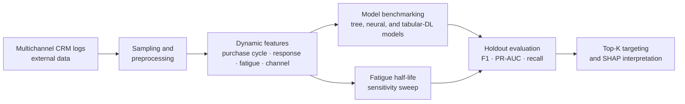
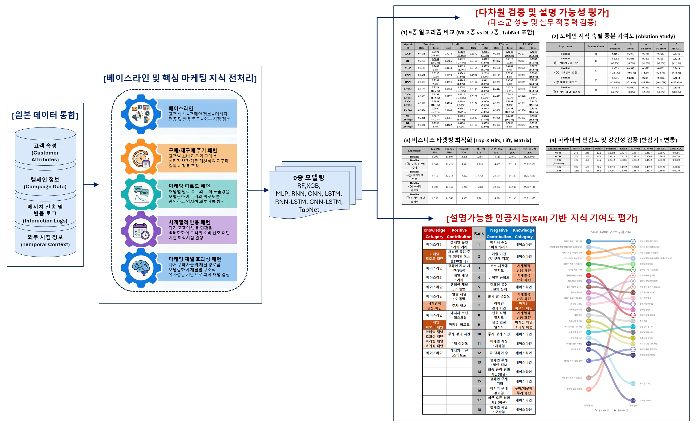
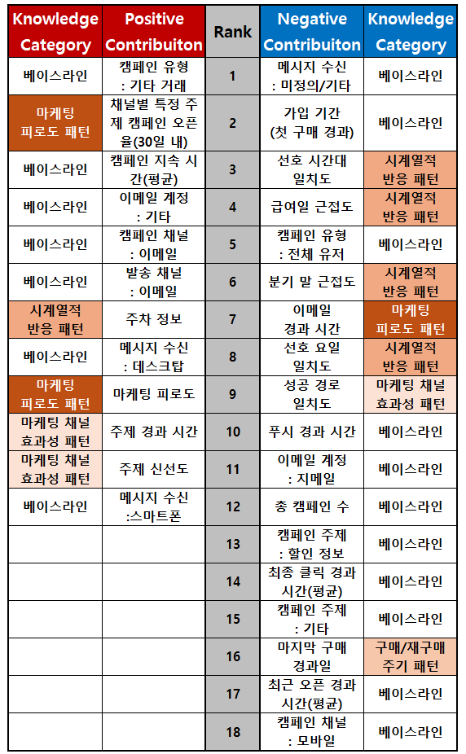
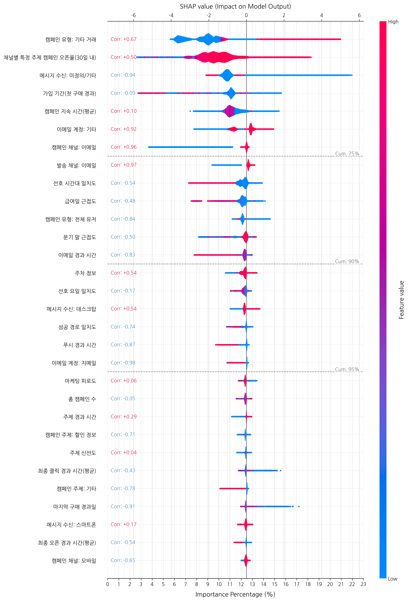

# Dynamic Marketing Knowledge for Purchase Conversion Prediction

[한국어](README.ko.md)

> [Project details](PORTFOLIO.md)

An evidence-based data-centric AI study of purchase conversion prediction in an
extremely imbalanced e-commerce CRM setting. The project converts marketing
theory into dynamic features and compares tree-based machine learning with deep
learning and tabular deep-learning models.

> This README separates study-level reported values from results retained in
> executable code artifacts.

## Research question

Can dynamic domain-knowledge features improve purchase conversion prediction
and marketing targeting decisions when the positive conversion class is rare?

The research operationalizes four feature groups:

1. Purchase and repurchase-cycle patterns
2. Temporal response patterns
3. Marketing-fatigue patterns
4. Marketing-channel effectiveness patterns

## Dataset and evaluation

- **Source data:** two years of multichannel e-commerce CRM logs
- **Scale:** approximately 172 million messaging events
- **Target:** purchase conversion
- **Holdout conversion rate:** 0.1234%
- **Models compared:** 9 ML, neural-network, and tabular-DL models
- **Evaluation:** original-distribution holdout set, including F1, PR-AUC,
  recall, and targeting analyses

## Analysis flow



The raw CRM logs are not included in this repository. The executable pipeline
and compact result reports provide the implementation and evidence trail for
the flow above.

## Key results

The submitted research study reports that the domain-enhanced XGBoost model achieved the best
overall classification performance:

| Measure | Result |
|---|---:|
| F1 score | 0.3806 |
| PR-AUC | 0.3620 |
| Recall, baseline -> domain-enhanced | 30.74% -> 52.30% |
| Relative recall improvement | 70.1% |
| Targeting at top 0.78% | 95.83% of conversions captured |
| Message-volume reduction at that threshold | 99.22% |

These results should be interpreted as study-specific evidence from the documented
dataset and holdout experiment, not as a general causal estimate. The study identifies
single-platform generalization, fixed fatigue half-life parameters, causal
inference, and unmeasured compute efficiency as limitations.

## Research figures

The figures summarise the documented research workflow and reported results.
They replace the previously top-level image set; the prior images remain under
`images/legacy/` for traceability.



*Figure 1. The research workflow: CRM inputs, domain-informed
features, model comparison, targeting evaluation, and explanation analysis.*



*Figure 2. Research-study comparisons cover model performance, feature
ablation, targeting, and parameter sensitivity. These are reported study
results, distinct from the JSON output retained in this repository.*



*Figure 3. SHAP values summarize the direction and relative contribution of
the retained features in the documented model run. They are associational,
not evidence of causal uplift.*

## Repository layout

```text
.
├── research/                         # Integrated executable research work
│   ├── preprocessing_fast.py          # Feature engineering pipeline
│   ├── xgb.py, RF.py, MLP.py          # Tabular-model experiments
│   ├── CNN.py, RNN.py, LSTM.py        # Neural baselines
│   ├── CNNLSTM.py, RNNLSTM.py, tabnet.py
│   ├── run_xgb_tau_sweep.py           # Fatigue half-life sensitivity sweep
│   └── predict/                       # Compact JSON/CSV experiment outputs
├── images/
│   ├── paper/                         # Research figures retained for this project
│   └── legacy/                        # Previous repository images
└── references/
    └── legacy-prior-research/         # Prior reference snapshot
```

## Reproducibility notes

The large Parquet datasets and fitted model binaries are intentionally excluded
from Git (`*.parquet`, `*.pkl`). Configure local data paths or the relevant
environment variables before running the research scripts. The compact result
reports are retained under `research/predict/` so reported evaluation results
can be inspected without downloading multi-gigabyte artifacts.

## References

Prior-literature notes retained during project development are available under
`references/legacy-prior-research/`.

## Documentation

- [Portfolio case study](PORTFOLIO.md)
- [Repository review](docs/PROJECT_REVIEW.md)
- [Academic summary](docs/ACADEMIC_SUMMARY.md)
- [CV bullets](docs/CV_BULLETS.md)

## How to run

An end-to-end command is **not yet verified** because the source data, fitted models, dependency lockfile, and portable path configuration are not included.
The executable research entry points are `research/preprocessing_fast.py`, `research/xgb.py`, and `research/run_xgb_tau_sweep.py`.
See `docs/PROJECT_REVIEW.md` before attempting to run them.

The refactored path configuration and result-regression procedure are documented in [research/RUN_MANIFEST.md](research/RUN_MANIFEST.md).
Install the import-derived packages from `requirements.txt`, then pin the original environment before asserting exact numerical reproduction.
